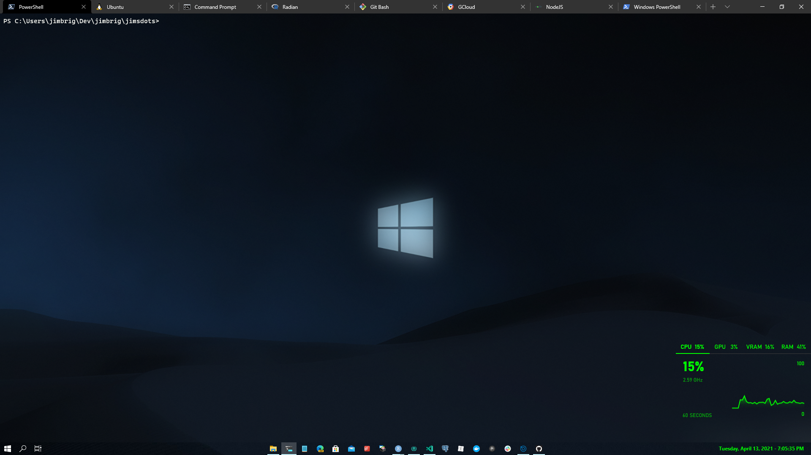

# Jim’s `.dotfiles`

## Setup Guides

- [nodejs/npm](./nodejs/), [yarn](yarn/)
- [gcloud](./gcloud/)
- [gpg](./gpg/)
- [ssh](./ssh/)
- [excel](./excel/)
- [git](./git/)
- [python](./python/)
- [typora](./typora/)
- [chocolatey](./chocolatey)
- [scoop](./scoop/)
- [powershell](./powershell/)
- [WSL](./wsl/)
- [winget](./winget/)
- [R](./R/)
- [RStudio](./rstudio/)
- [python](./python/)
- [topgrade](./topgrade/)
- [Firefox Developer](./firefox/)

## Encrypted Secrets

Throughout the repo, all secrets are encrypted and locked as binaries via [Git-Crypt](https://github.com/AGWA/git-crypt) and the [.gitattributes](.gitattributes) configuration file (tells git-crypt what to encrypt).

List of all encrypted files via `git-crypt status -e`:

Install `git-crypt` via `scoop install git-crypt` on Windows or `brew install git-crypt` on UNIX.

### Git-Attributes

[Git-Crypt](https://github.com/AGWA/git-crypt) encrypted file declarations as well as [Git-LFS](https://git-lfs.github.com/) specifications are declared in the [.gitattributes](./.gitattributes) file:

<!-- MARKDOWN-AUTO-DOCS:START (CODE:src=./.gitattributes)> -->
<!-- The below code snippet is automatically added from ./.gitattributes -->

<!-- MARKDOWN-AUTO-DOCS:END -->

