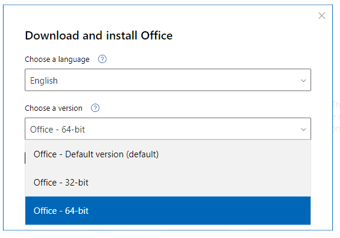

# Excel 

## Installation

- [ ] Download Office365 ISO from [Microsoft Account Website](https://account.microsoft.com/services/microsoft365/install).
	- [ ] **Ensure to select 64-bit installer**
	- [ ] Select option to download an Offline Installer for usage in the future if necessary.



- [ ] Once installer downloads, mount the ISO, extract the zipped archive and run the **64-bit** installer under a separate folder.
- [ ] Install Office365 and restart machine.
- [ ] Open any office application and select `Office Account > Office Insider` and join the **Beta Channel**.
- [ ] Update Office365


## Excel Setup

### PERSONAL.xlsb and Macros

- [ ] Clone Excel repository from Github: [jimbrig/excel-config](https://github.com/jimbrig/excel-config)

```
git clone git@github.com:jimbrig/excel-config.git
cd excel-config
```

> Note that this repo has a submodule for xl-macros repo.

- [ ] Open Excel and turn on AutoSave
- [ ] Copy and Paste [[PERSONAL.xlsb]] into <https://d.docs.live.net/c58858cfd97d35ae/Documents> where OneDrive stores office files.
- [ ] Alternatively, create a dummy Macro via `Developer > Record Macro > Personal Workbook` and then unhide via `View > Unhide > PERSONAL.xlsb`.
- [ ] Add macros to PERSONAL.xlsb via `Alt + F11` and import `Main.bas`
- [ ] Save PERSONAL.xlsb and close excel.

Local Path for PERSONAL.xlsb: `%appdata%\Microsoft\Excel\XLSTART`

or

`C:\Program Files\Microsoft Office\root\Office16\STARTUP`

### Add-Ins

**First, Enable Developer Tab in Ribbon**

Links: <https://exceldashboardschool.com/how-to-install-an-excel-add-in/>

***

#### Excel Add-Ins

Path: `C:\Users\jimbr\AppData\Roaming\Microsoft\AddIns`

- [ ] [Solver](https://support.microsoft.com/en-us/office/load-the-solver-add-in-in-excel-612926fc-d53b-46b4-872c-e24772f078ca?ui=en-us&rs=en-us&ad=us)
- [ ] [Analysis Toolpak](https://support.microsoft.com/en-us/office/load-the-analysis-toolpak-in-excel-6a63e598-cd6d-42e3-9317-6b40ba1a66b4?ui=en-us&rs=en-us&ad=us)
- [ ] [PowerPivot](https://support.microsoft.com/en-us/office/start-the-power-pivot-add-in-for-excel-a891a66d-36e3-43fc-81e8-fc4798f39ea8?ui=en-us&rs=en-us&ad=us)
- [ ] [Forecast Wizard](https://docs.microsoft.com/en-us/previous-versions/sql/sql-server-2016/dn282376(v=sql.130)?redirectedfrom=MSDN)

#### Oliver Wyman Add-Ins

- [ ] Function.xla
- [ ] Toolbar Add In.xlam
- [ ] Tools.xlam

#### COM Add-Ins

Path: `C:\Program Files\Microsoft Office\root\Office16\ADDINS`

- [ ] Microsoft Data Streamer for Excel
- [ ] Microsoft Power Map for Excel
- [ ] Microsoft Power Pivot for Excel

#### Store Add-Ins

Manage from [here](https://store.office.com/myapps.aspx?client=Win32_Excel&cv=16.0.0.0&pm=0&ClientSessionId=%7B55ADDD49-6FA7-4C23-8ACB-908CD167CC82%7D&lcid=1033&syslcid=1033&uilcid=1033&ui=en-US&rs=en-US&ad=US&fromAR=1&AuthType=1).

- [ ] [Money in Excel](https://appsource.microsoft.com/en-us/product/office/WA200001306?src=office&corrid=38c589f7-0b84-49d6-89c1-9b5723da1319&omexanonuid=74183fb0-30ac-4570-889c-d029b5dae844&referralurl=)
- [ ] [Excel-to-Word Document Automation](https://appsource.microsoft.com/en-us/product/office/WA104380955?src=office&corrid=3b378e68-74a2-49b6-ac87-b6d617c228a0&omexanonuid=6612e48a-a90d-4f50-9272-c47d209de3fa&referralurl=)
- [ ] [Explore the Data](https://appsource.microsoft.com/en-us/product/office/WA104379481?src=office&corrid=e766f2d7-4486-41cc-b86c-049c4d0a0aec&omexanonuid=b0f59df9-2f4d-436f-8aea-8962cfa5ad4e&referralurl=)
- [ ] [Mini Calendar and Date Picker](https://appsource.microsoft.com/en-us/product/office/WA102957665?src=office&corrid=bf2bf20a-3a85-4a99-a9c3-a673bd3859a1&omexanonuid=0000de10-1ae4-4ea8-b445-724ac8580732&referralurl=)
- [ ] [Wikipedia](https://appsource.microsoft.com/en-us/product/office/WA104099688?src=office&corrid=ea2ab40f-574a-4c86-9340-2be96f040846&omexanonuid=53bad5a4-2150-4019-b089-865c3a378cb7&referralurl=)

#### New Downloaded Add-Ins

> Note: For these downloaded add-ins, will want to move to a trusted location and unblock the add-in under Security Settings.

- [ ] [DataXL](https://exceldashboardschool.com/free-excel-add-ins-tools/)
- [ ] [DataFX](https://exceldashboardschool.com/free-excel-add-ins-tools/)
- [ ] [Power-User](https://www.powerusersoftwares.com/installation-instructions)
- [ ] [X-Y Chart Labeler](http://www.appspro.com/Utilities/ChartLabeler.htm)
- [ ] [Favorites Bookmarks](https://www.add-ins.com/favorite_bookmarks.htm)

### Customization

#### Quick-Access Hotkeys and Toolbar

Load the configuration file under: `xl-config/Excel Customizations.exportedUI`.

In order,

1. [ ] Paste Special
1. [ ] Toggle Read Only
1. [ ] Name Manager
1. [ ] Macros
1. [ ] Page Setup
1. [ ] Toggle Filters
1. [ ] Add/Remove Filters
1. [ ] Pivot Table
1. [ ] Refresh All
1. [ ] Calculate
1. [ ] Datasheet Formatting
1. [ ] Email with Attachment
1. [ ] COM Add-Ins
1. [ ] Excel Add-Ins
1. [ ] Autosave Toggle

**If make any changes ensure to backup in the .ExportUI file under Program-Settings/Excel**

## Templates

- <https://www.goskills.com/Excel/Resources/Free-Excel-templates>
- 
