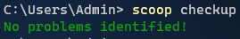

# Scoop

Scoop is a command-line installer for Windows.

Github Repo: [lukesampson/scoop](https://github.com/lukesampson/scoop)

***

## Requirements

- Windows 7 SP1+ / Windows Server 2008+
- [PowerShell 5](https://aka.ms/wmf5download) (or later, include [PowerShell Core](https://docs.microsoft.com/en-us/powershell/scripting/install/installing-powershell-core-on-windows?view=powershell-6)) and [.NET Framework 4.5](https://www.microsoft.com/net/download) (or later)
- PowerShell must be enabled for your user account e.g. `Set-ExecutionPolicy -ExecutionPolicy RemoteSigned -Scope CurrentUser`

## Installation

Run the following command from your PowerShell to install scoop to its default location (`C:\Users\<user>\scoop`)

```powershell
Invoke-Expression (New-Object System.Net.WebClient).DownloadString('https://get.scoop.sh')

# or shorter
iwr -useb get.scoop.sh | iex
```

Once installed, run `scoop help` for instructions. Also run `scoop checkup` to see if any issues are affecting scoop's status. Some useful commands to run are:

```powershell
# install sudo
scoop install sudo

# disable scoop from windows defender realtime scanning
sudo Add-MpPreference -ExclusionPath 'C:\ProgramData\scoop'
sudo Add-MpPreference -ExclusionPath 'C:\Users\jimbr\scoop'

# enable long path support in registry
sSet-ItemProperty 'HKLM:\SYSTEM\CurrentControlSet\Control\FileSystem' -Name 'LongPathsEnabled' -Value 1
```



The default setup is configured so all user installed programs and Scoop itself live in `C:\Users\<user>\scoop`. Globally installed programs (`--global`) live in `C:\ProgramData\scoop`. These settings can be changed through environment variables.

Setup virustotal scanning with your accounts API key:

```powershell
scoop config virustotal_api_key <api_key>
```

## Buckets

The following buckets are known to scoop:

- [main](https://github.com/ScoopInstaller/Main) - Default bucket for the most common (mostly CLI) apps
- [extras](https://github.com/lukesampson/scoop-extras) - Apps that don't fit the main bucket's [criteria](https://github.com/lukesampson/scoop/wiki/Criteria-for-including-apps-in-the-main-bucket)
- [games](https://github.com/Calinou/scoop-games) - Open source/freeware games and game-related tools
- [nerd-fonts](https://github.com/matthewjberger/scoop-nerd-fonts) - Nerd Fonts
- [nirsoft](https://github.com/kodybrown/scoop-nirsoft) - A subset of the [250](https://github.com/rasa/scoop-directory/blob/master/by-score.md#MCOfficer_scoop-nirsoft) [Nirsoft](https://nirsoft.net/) apps
- [java](https://github.com/ScoopInstaller/Java) - Installers for Oracle Java, OpenJDK, Zulu, ojdkbuild, AdoptOpenJDK, Amazon Corretto, BellSoft Liberica & SapMachine
- [jetbrains](https://github.com/Ash258/Scoop-JetBrains) - Installers for all JetBrains utilities and IDEs

- [nonportable](https://github.com/TheRandomLabs/scoop-nonportable) - Non-portable apps (may require UAC)
- [php](https://github.com/ScoopInstaller/PHP) - Installers for most versions of PHP
- [versions](https://github.com/ScoopInstaller/Versions) - Alternative versions of apps found in other buckets

The main bucket is installed by default. To add any of the other buckets, type:

```powershell
scoop bucket add bucketname
```

For example, to add the extras bucket, type:

```powershell
scoop bucket add extras
```

See the [scoop directory](https://github.com/rasa/scoop-directory).

## Chocolatey Comparison

#### How is Scoop different to [Chocolatey](http://chocolatey.org/)?

- **Installs to ~/scoop/ by default.** You can set up your own programs and not worry that they'll interfere with other users' programs (or theirs with yours, perhaps more importantly). You can optionally choose to install programs system-wide if you have administrator rights.
- **No UAC popups, doesn't require admin rights.** Since programs are installed just for your user account, you won't be interrupted by UAC popups.
- **Doesn't pollute your path.** Where possible, Scoop puts your program shims in a single directory and just adds that to your path.
- **Doesn't use NuGet.** NuGet is a great solution to the problem of managing software library dependencies. Scoop avoids this problem altogether: each program you install is isolated and independent.
- **Simpler than packaging.** Scoop isn't a package manager, rather it reads plain JSON manifests that describe how to install a program and its dependencies.
- **Simpler app repository.** Scoop just uses Git for its app repository. You can create your own repo, or even just a single file that describes an app to install.

**NOTE** While it would be easy to install Skype with Scoop, this will probably never be in Scoop's main bucket (app repository). Scoop focuses on open-source, command-line developer tools. The [scoop-extras](https://github.com/lukesampson/scoop-extras) bucket is for non developer tools.

## Commands

Information on Scoop's commands is built-in. If you use Git you should find the help interface familiar.

To see a list of commands, run:

```powershell
scoop help
```

To see help on a specific command, run:

```powershell
scoop help <command>
```

The current commands are (output from `scoop help`):

```powershell
alias          Manage scoop aliases
bucket         Manage Scoop buckets
cache          Show or clear the download cache
checkup        Check for potential problems
cleanup        Cleanup apps by removing old versions
config         Get or set configuration values
create         Create a custom app manifest
depends        List dependencies for an app
export         Exports (an importable) list of installed apps
help           Show help for a command
hold           Hold an app to disable updates
home           Opens the app homepage
info           Display information about an app
install        Install apps
list           List installed apps
prefix         Returns the path to the specified app
reset          Reset an app to resolve conflicts
search         Search available apps
status         Show status and check for new app versions
unhold         Unhold an app to enable updates
uninstall      Uninstall an app
update         Update apps, or Scoop itself
virustotal     Look for app's hash on virustotal.com
which          Locate a shim/executable (similar to 'which' on Linux)

```

## Example Setup Scripts

Here are some example 'get-all-my-stuff' scripts.

It's assumed that you have Powershell 5 and you've already installed Scoop, e.g.

```powershell
iex (new-object net.webclient).downloadstring('https://get.scoop.sh')
set-executionpolicy unrestricted -s cu
```

### Example dev environment setup

```powershell
# utils
scoop install 7zip curl sudo git openssh coreutils grep sed less

# programming languages
scoop install python ruby go nodejs

# WAMP stack
scoop install apache mariadb php
iex (new-object net.webclient).downloadstring('https://gist.github.com/lukesampson/6546858/raw/apache-php-init.ps1')

# console theme
scoop install concfg pshazz
concfg import solarized small

# vim
scoop install vim
'
set ff=unix

set cindent
set tabstop=4
set shiftwidth=4
set expandtab
set backupdir=$TEMP
' | out-file ~/.vimrc -enc oem -append
```

### Example production environment setup

```powershell
scoop install sudo 7zip

# make these available to system processes
sudo scoop install git ruby postgres --global

# just for me
scoop install grep coreutils
```


## Powershell Modules

PowerShell modules are installed like other apps, but they are also linked under `~\scoop\modules`.

The `~\scoop\modules` directory will be added to your `$env:PSModulePath` environment variable, and PowerShell should automatically detect the modules you install here using Scoop.

The directories under `~\scoop\modules` aren't normal directories. Each is a **directory junction** which points to the currently installed version of the app/module, which is itself a directory junction pointing to the actual versioned directory. So for a module named `MyPSModule` you might have something like this:

```
~\scoop\modules\MyPSModule`
 → *points to* `~\scoop\apps\mypsmodule\current`
  → *points to* `~\scoop\apps\mypsmodule\1.16.0.rc2
```

The key part of the [Scoop manifest](https://github.com/lukesampson/scoop/wiki/App-Manifests) for a PowerShell module is this:

```
{
...
    "psmodule": {
        "name": "NameOfTheModule"
    }
...
}
```

The `name` property is required if you use `psmodule`, and it should match the name of the `.psd1` manifest for the PowerShell module for PowerShell to consider it "well-formed" and automatically detect the module (see [here](https://msdn.microsoft.com/en-us/library/dd878350(v=vs.85).aspx) for more.)

## Shovel

[Ash258/Scoop-Core: Shovel. Alternative, more advanced, and user-friendly implementation of windows command-line installer scoop. (github.com)](https://github.com/Ash258/Scoop-Core)

```powershell
scoop install sudo
sudo scoop install 7zip git openssh --global
scoop install aria2 curl grep sed less touch
scoop install python ruby go perl
```

## My Installed Packages

I primarily use [Chocolatey](../chocolatey/) and [winget](.../winget/) as my package managers on windows, however, scoop has some amazing benefits and also includes some packages that the aforementioned managers do not.

My Buckets:

- main
- extras
- scoop-completion
- nonportable
- nerd-fonts
- r-bucket
- sysinternals
- wsl
- rasa/scoops
- scoop/retools
- dorado

Add buckets:

```powershell
scoop bucket add extras
scoop bucket add scoop-completion
scoop bucket add nonportable
scoop bucket add nerd-fonts
scoop bucket add r-bucket https://github.com/cderv/r-bucket.git
scoop bucket add Sysinternals 'https://github.com/Ash258/Scoop-Sysinternals.git'
scoop bucket add wsl https://git.irs.sh/KNOXDEV/wsl
scoop bucket add rasa https://github.com/rasa/scoops.git
scoop bucket add retools https://github.com/TheCjw/scoop-retools.git
scoop bucket add dorado https://github.com/chawyehsu/dorado
```

## Apps

Here's what I use scoop to install:

- [aria2](https://github.com/aria2/aria2): multi-connection downloads.
- [runat](https://github.com/ScoopInstaller/Main/blob/master/bucket/runat.json)
- [api-monitor](http://www.rohitab.com/apimonitor)
- [drivecleanup](http://www.uwe-sieber.de/drivetools_e.html)
- [eolfix](https://github.com/rasa/eolfix)
- [isobuster](https://www.isobuster.com/)
- [mklnk](https://github.com/rasa/mklnk)
- [regdelta](https://github.com/rasa/regdelta)
- [py](https://bitbucket.org/vinay.sajip/pylauncher/downloads/)
- [wfc](https://www.binisoft.org/wfc.php)
- [fastcopy](https://fastcopy.jp/en/)
- [mailsend](https://github.com/muquit/mailsend/)
- [Win+X Menu Editor **(WinXMenuEditor)**](https://github.com/Ash258/Scoop-Ash258/blob/main/bucket/WinXMenuEditor.json)
- [Windows 10 Initial Setup **(Win10InitialSetup)**](https://github.com/Ash258/Scoop-Ash258/blob/main/bucket/Win10InitialSetup.json)
- [Windows 10 Update Assistant **(Windows10UpdateAssistant)**](https://github.com/Ash258/Scoop-Ash258/blob/main/bucket/Windows10UpdateAssistant.json)
- [winget **(winget)**](https://github.com/Ash258/Scoop-Ash258/blob/main/bucket/winget.json)
- [Windows Terminal Preview **(WindowsTerminal-preview)**](https://github.com/Ash258/Scoop-Ash258/blob/main/bucket/WindowsTerminal-preview.json)
- [Windows Repair Toolbox **(WindowsRepairToolbox)**](https://github.com/Ash258/Scoop-Ash258/blob/main/bucket/WindowsRepairToolbox.json)
- [W10Privacy **(W10Privacy)**](https://github.com/Ash258/Scoop-Ash258/blob/main/bucket/W10Privacy.json)
- [DockerCompletion](https://github.com/matt9ucci/DockerCompletion)
- [PSKubectlCompletion](https://github.com/mziyabo/PSKubectlCompletion)
- [RapidEE](https://www.rapidee.com/en/about)
- [rclone-browser](https://github.com/kapitainsky/RcloneBrowser)
- [rufus](https://rufus.ie/)
- [sql-workbench-dedv](https://www.sql-workbench.eu/)
- sysinternals
- [ssh-agent-wsl](https://github.com/rupor-github/ssh-agent-wsl")
- [PostInstall](https://gist.githubusercontent.com/Ash258/e143436e2f9183a650424d635b535e51/raw/PostInstall.Win10InitialSetup.ps1)
- [winget-cli](https://github.com/microsoft/winget-cli)
- [git-filter-repo](https://github.com/newren/git-filter-repo)

As well as,

- git-crypt
- scoop-completion
- sudo
- 7zip
- curl
- grep
- innounp
- less
- lessmsi
- postgresql
- psutils
- scoop
- touch
- rstudio-daily / rstudio-preview
- TinyTex (tinytex-extra, tinytex-min)
- r-release
- win10-initial-setup-script
- ShellExView
- volta
- Android Studio, Android SDK

### WSL

A [scoop bucket](https://scoop.sh/) of installers for [Windows Subsystem for Linux](https://docs.microsoft.com/en-us/windows/wsl/about).

Make absolutely certain to [enable the WSL feature](https://docs.microsoft.com/en-us/windows/wsl/install-win10) first, like so:

```
Enable-WindowsOptionalFeature -Online -FeatureName Microsoft-Windows-Subsystem-Linux
```

Install scoop like this:

```
iex (new-object net.webclient).downloadstring('https://get.scoop.sh')
```

Then install this software bucket like this:

```
scoop bucket add wsl https://git.irs.sh/KNOXDEV/wsl
```

Now you can quickly and automatically install the software registered here. No Windows Store necessary. For example, to install Ubuntu 20.04 LTS, just use:

```
scoop install wsl-ubuntu2004
```

For a full list of current supported distros, check the bucket, or just run:

```
scoop search wsl-
```

That's it! The software in this bucket should not be considered stable and may not install successfully while its a Work In Progress.

### notes

- I decided to not add hashes to the manifest due to a lack of consistent versioning information. It's unclear if Microsoft will push in-place upgrades of the distro download links I'm using, but that is what I suspect, in which case the hashes do more harm than good. The installers themselves have built-in integrity checks, so I'm not too concerned about it.
- Whichever distro you install *first* will be your default from then on out. Your default distro is the one that opens when you `Right Click > Open Linux shell here` or use `wsl.exe` from the command line. You can reset your default by using [wslconfig](https://docs.microsoft.com/en-us/windows/wsl/wsl-config#managing-multiple-linux-distributions).
- Uninstalling a distro and reinstalling it with scoop will **DELETE** everything stored in that distros filesystem and set it back to scratch. This includes if you UPDATE the distro via scoop, although I have no plans to publish updates to existing distro manifests since you can just update them with a package manager.


